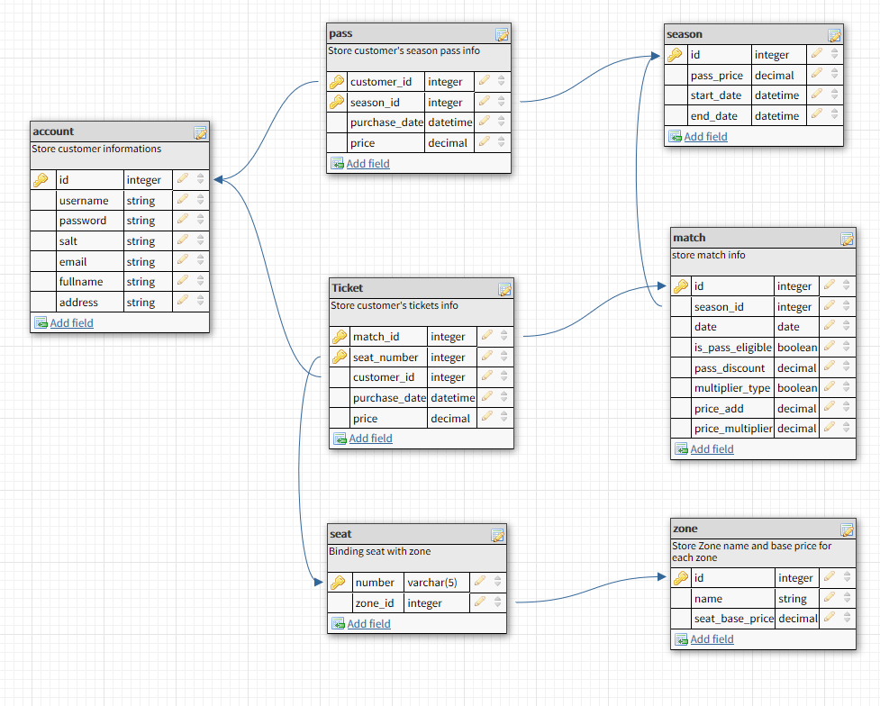

# IAM_CONSULTING_TEST
## 1. Palindrome
```javascript
function isPalindrome(word){
	let evenLength = word.length % 2 == 0
	let palindromLength = (evenLength?word.length: word.length - 1) / 2
	if (word.slice( 0 , palindromLength).toLowerCase() != word.slice(evenLength? palindromLength : palindromLength + 1).split('').reverse().join('').toLowerCase())
	{
		return false
	}
	return true
}
```
## 2. Group words with same set of characters 
```javascript
function groupSimilarWords(words){
	
	function sortChar(item){
		return item.split('').sort().join('')
	}

	group = {}

	words.forEach( (item) => {
		let sortedChar = sortChar(item)
		if ( ! group[sortedChar] ) {
			group[sortedChar] = []
		}
		group[sortedChar].push(item)
	})
	let groupCount = 1
	for ( key in group) {
		console.log( groupCount++ + ". " + group[key].join(' - '))
	}
}
```
## 3. Create function that generate possible strings of size N in set of N characters
```javascript
function generateString(chars){
	
	resultSet = []
	
	function getString(charsPool, prefix){
		if(charsPool.length == 1){
			let word = prefix + charsPool[0]
			if( !resultSet.includes(word)){
				resultSet.push( prefix + charsPool[0])
			}
		} else {
			for (let i = 0; i < charsPool.length; i++){
				let currentChar = charsPool.splice(i,1)[0]
				getString(charsPool, prefix + currentChar);
				charsPool.splice(i,0,currentChar)
			}
		}
	}
	
	getString(chars.split(''), '')
	console.log(resultSet.join(', '))
}
```
## 4. Given an integer n, Find the sum of 11 + 22 + 33 + ….. + nn  
```javascript
function NPowerSum(n){
	let sum = 0
	for( let i =  1; i <= n; i++){
		sum += Math.pow(i,i)
	}
	return sum
}

```
## System Analysis and Design  

